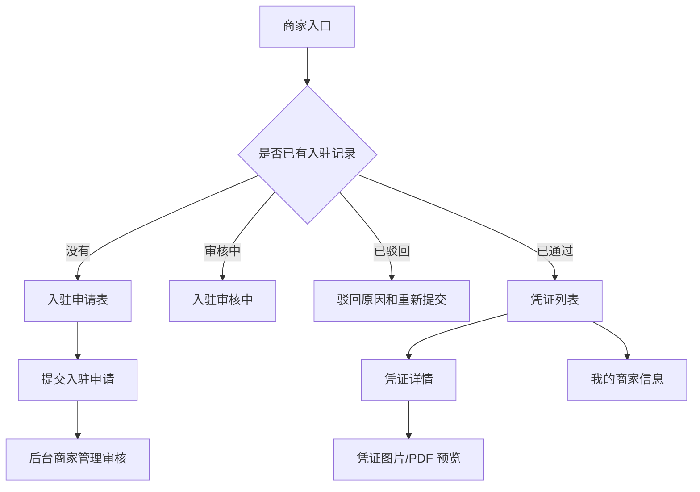
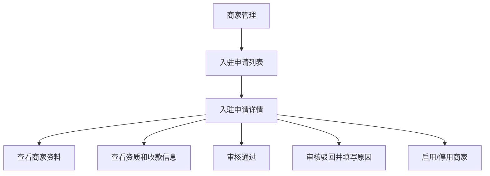
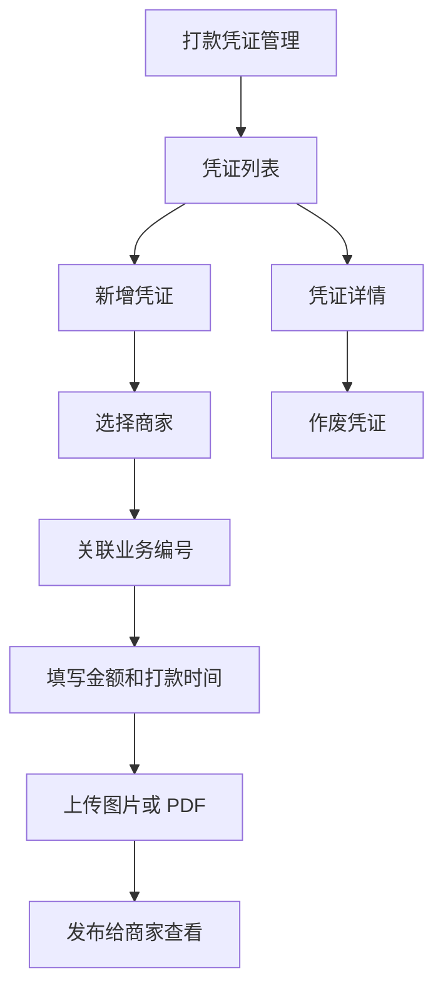
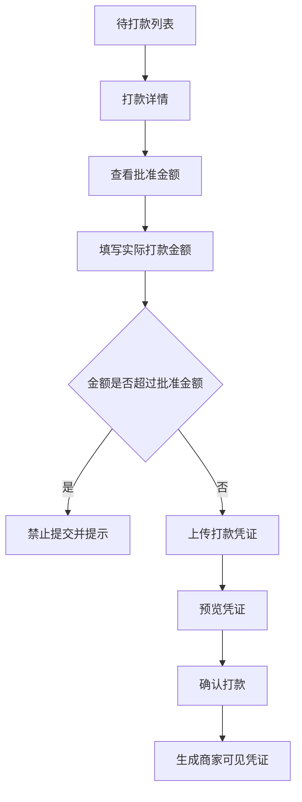

# v1.3 H5 业务体验优化设计说明

日期：2026-06-08  
范围：P2BOYUAN 根据《手机分期回收平台_标准完整PRD_v1.3》进行体验改造  
状态：已按最新 PRD 修订

## 1. 背景和目标

最新 PRD v1.3 已经重新定义了商家角色。商家不再承载客户分期用机申请的提交、补资料、审核、合同、账单、逾期或锁机/解锁流程。商家的核心闭环变为：

- 商家提交入驻申请。
- 平台后台审核商家入驻资料。
- 商家审核通过后登录商家端。
- 商家查看公司提供给本商家的打款凭证。
- 商家查看自己的商家资料和入驻状态。

因此，本次设计改造的第一原则是：商家权限收敛，凭证查看清晰，后台管理补齐。业务员和财务人员继续按 H5 工作台体验优化，审核员和超级管理员保留电脑后台风格。

## 2. 总体方案

采用混合双端体验：

- 商家、业务员、财务/出纳：移动 H5 优先，使用底部 Tab、卡片列表、纵向详情页。
- 审核员、超级管理员：电脑后台优先，使用左侧菜单、筛选区、表格列表、详情抽屉。
- 状态名称：使用本系统业务状态，不照搬竞品状态。
- 颜色风格：借鉴竞品浅蓝、浅绿、白色卡片、柔和边框和轻量阴影。
- 权限策略：商家只能访问本商家的入驻信息和打款凭证，不能访问客户完整申请资料。

## 3. 信息架构

### 3.1 商家 H5

底部 Tab：

- 入驻
- 凭证
- 我的

说明：

- 未提交入驻：默认进入入驻申请表。
- 入驻审核中：展示审核中状态，不允许进入凭证列表。
- 入驻驳回：展示驳回原因，允许修改后重新提交。
- 入驻通过：默认进入凭证列表。
- 商家不提供“订单”“录单台”“补资料”入口。

### 3.2 业务员 H5

底部 Tab：

- 任务
- 协助
- 我的

说明：

- 业务员可查看跟进任务。
- 业务员可协助客户和商家线下沟通。
- 业务员不拥有最终审核、放款、账单、逾期、锁机/解锁权限。

### 3.3 财务/出纳 H5

底部 Tab：

- 打款
- 凭证
- 我的

说明：

- 财务人员确认线下打款。
- 上传打款凭证。
- 打款金额不能超过申请批准金额。
- 已上传凭证可预览。

### 3.4 后台端角色

审核员后台：

- 申请列表
- 派单与审核
- 详情抽屉

超级管理员后台：

- 数据概览
- 商家管理
- 打款凭证管理
- 测试账号
- 状态调整
- 一键重置测试数据

## 4. 页面结构图

### 4.1 商家入驻与凭证查看

### 4.2 后台商家管理

### 4.3 后台打款凭证管理

### 4.4 财务打款流程

## 5. 页面清单和字段

### 5.1 登录页

用途：所有角色统一登录入口。

核心模块：

- 产品标题：手机分期回收平台
- 账号输入
- 密码输入
- 角色快捷账号列表
- 登录按钮

规则：

- 不再出现测试宣传类文案，界面只表达正式业务系统语义。
- 登录后根据角色进入对应首页。
- 移动端使用单列 H5 布局。

### 5.2 商家 - 入驻申请

用途：商家提交平台入驻资料。

字段：

- 申请人姓名
- 申请人手机号
- 申请人证件号码
- 商家名称
- 商家地址
- 联系人姓名
- 联系人手机号
- 收款方式
- 收款账号
- 收款户名
- 开户行或收款渠道
- 身份证正面
- 身份证反面
- 营业执照或门店资质

规则：

- 姓名、手机号、证件号码、商家名称、商家地址、收款信息必填。
- 身份证正反面必传。
- 营业执照或门店资质必传。
- 提交后进入审核中。
- 驳回后显示原因并允许重新提交。
- 审核通过后才能进入凭证列表。

### 5.3 商家 - 打款凭证列表

用途：商家查看公司提供给本商家的打款凭证。

筛选：

- 全部
- 待确认
- 已打款
- 已作废

卡片字段：

- 凭证编号
- 打款金额
- 打款状态
- 打款时间
- 关联业务编号
- 查看详情入口

权限规则：

- 只能查看本商家的凭证。
- 不显示客户完整申请资料。
- 不显示合同、账单、逾期、锁机/解锁信息。

### 5.4 商家 - 打款凭证详情

字段：

- 凭证编号
- 商家名称
- 打款金额
- 打款状态
- 打款时间
- 收款主体
- 脱敏收款账号
- 付款方名称
- 关联业务编号
- 凭证图片或 PDF
- 备注
- 作废原因

规则：

- 只读。
- 支持图片和 PDF 预览。
- 收款账号必须脱敏。
- 作废凭证展示作废原因。

### 5.5 商家 - 我的商家信息

字段：

- 商家名称
- 商家编号
- 商家地址
- 联系人
- 联系电话
- 入驻状态
- 脱敏收款信息
- 资质状态

规则：

- 审核中不能修改核心资料。
- 已驳回可根据驳回原因重新提交。
- 已通过后修改收款信息需要重新审核。

### 5.6 业务员 - 任务页

用途：业务员查看跟进任务和客户协助事项。

核心模块：

- 任务统计
- 状态筛选
- 任务卡片列表
- 任务详情

权限边界：

- 可查看被分配任务所需的必要信息。
- 不可最终审核。
- 不可确认打款。
- 不可查看不相关商家的凭证。

### 5.7 财务/出纳 - 打款页

用途：财务人员确认线下打款并上传凭证。

规则：

- 打款金额不能超过申请批准金额。
- 未上传凭证不能确认打款。
- 已打款记录只允许查看，不允许重复确认。
- 凭证确认后，商家端可在自己的凭证列表查看。

### 5.8 审核员后台

用途：电脑端高效筛选、派单和审核用户申请。

视觉优化：

- 保留后台布局。
- 列表与详情不互相遮挡。
- 详情使用抽屉或独立详情页。

### 5.9 超级管理员后台

新增模块：

- 商家管理
- 打款凭证管理

商家管理能力：

- 查看商家入驻申请列表。
- 查看入驻详情。
- 审核通过。
- 审核驳回并填写原因。
- 启用/停用商家。

打款凭证管理能力：

- 查看凭证列表。
- 新增凭证。
- 关联商家。
- 关联业务编号。
- 上传凭证图片或 PDF。
- 作废凭证。

## 6. 状态展示规则

### 6.1 商家入驻状态

| 状态值 | 中文展示 | 说明 |
| --- | --- | --- |
| DRAFT | 待提交 | 商家尚未提交完整资料 |
| PENDING_REVIEW | 审核中 | 等待平台审核 |
| APPROVED | 审核通过 | 可登录商家端查看凭证 |
| REJECTED | 已驳回 | 展示原因，可重新提交 |
| DISABLED | 已停用 | 后台停用，不能进入商家端 |

### 6.2 商家凭证状态

| 状态值 | 中文展示 | 说明 |
| --- | --- | --- |
| PENDING_CONFIRMATION | 待确认 | 凭证已生成，等待商家查看或确认 |
| PAID | 已打款 | 公司已完成打款并上传凭证 |
| VOIDED | 已作废 | 凭证无效，展示作废原因 |

## 7. 数据和接口影响

本次必须新增或调整后端能力，不能再只做前端样式。

新增数据能力：

- 商家入驻申请。
- 商家资质附件。
- 商家收款信息。
- 商家打款凭证。
- 凭证文件附件。
- 商家权限隔离。

新增接口方向：

- 商家提交入驻申请。
- 商家查询自己的入驻状态。
- 商家查询自己的凭证列表。
- 商家查询自己的凭证详情。
- 后台查询商家列表和入驻申请。
- 后台审核商家入驻申请。
- 后台创建、查看、作废打款凭证。

需要调整的旧能力：

- `STORE` 角色不再允许创建客户申请。
- `STORE` 角色不再允许提交客户补资料。
- `STORE` 角色不再允许查看客户完整申请详情。
- 如果仍保留线下协助客户选机，应归到用户端或业务员协助流程，不放在商家端核心功能中。

## 8. 本次实施边界

包含：

- 商家 H5 入驻申请。
- 商家 H5 入驻状态页。
- 商家 H5 凭证列表。
- 商家 H5 凭证详情与文件预览。
- 商家 H5 我的商家信息。
- 后台商家管理。
- 后台打款凭证管理。
- 商家权限隔离。
- 财务凭证上传后商家可见。
- 业务员和财务 H5 体验优化。
- 审核员和超级管理员后台视觉优化。

不包含：

- 真实短信验证码。
- 真实银行、支付 API。
- 真实合同签署。
- 用户端完整商城和账单系统。
- 逾期管理和锁机系统。
- 多语言正式生产配置。

## 9. 验收标准

商家：

- 未入驻商家不能进入凭证列表。
- 审核中商家只能看到审核中状态。
- 驳回商家能看到驳回原因并重新提交。
- 审核通过商家能查看本商家的凭证列表。
- 商家不能查看其他商家的凭证。
- 商家不能查看客户完整申请资料、合同、账单、逾期、锁机/解锁信息。
- 商家凭证详情支持图片和 PDF 预览。

后台：

- 超级管理员能审核商家入驻。
- 超级管理员能新增、查看、作废打款凭证。
- 后台商家管理和凭证管理不影响原申请审核流程。

财务：

- 打款金额不能超过批准金额。
- 凭证上传后可以预览。
- 确认打款后商家端能看到对应凭证。

视觉：

- 商家、业务员、财务在 390px 手机宽度下无横向滚动。
- 电脑后台列表与详情不互相遮挡。
- 页面不再出现测试宣传类文案，界面只表达正式业务系统语义。

## 10. 风险和处理

风险：当前 v0.1 代码中 `STORE` 已经参与客户申请，和 v1.3 冲突。  
处理：商家端重写为入驻和凭证查看；客户申请能力从商家角色中移除。

风险：商家凭证和财务打款记录容易混淆。  
处理：财务的 `payout_records` 表示内部打款操作；商家凭证表表示对商家可见的凭证展示记录，二者可关联但权限不同。

风险：后台新增商家管理和凭证管理会扩大开发范围。  
处理：先做最小闭环：入驻申请、审核通过/驳回、凭证新增、商家查看凭证；后续再扩展复杂配置。
