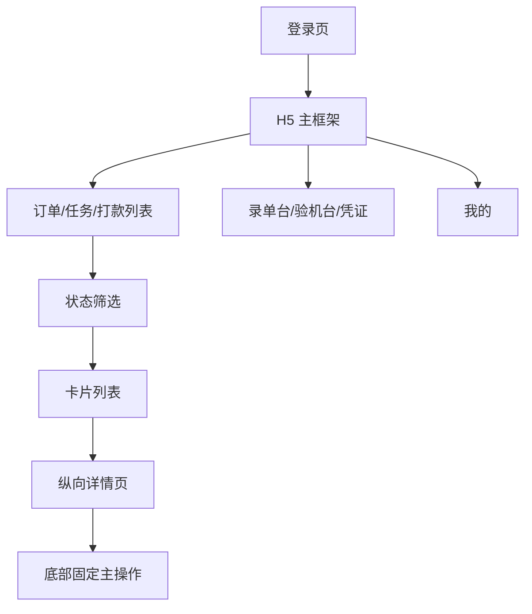
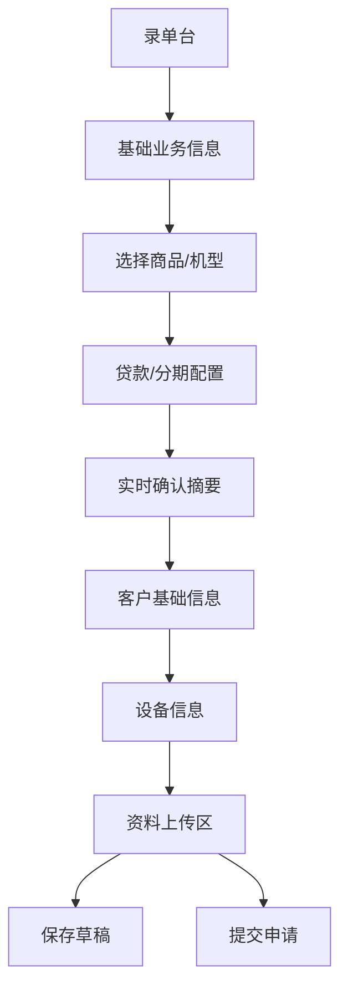
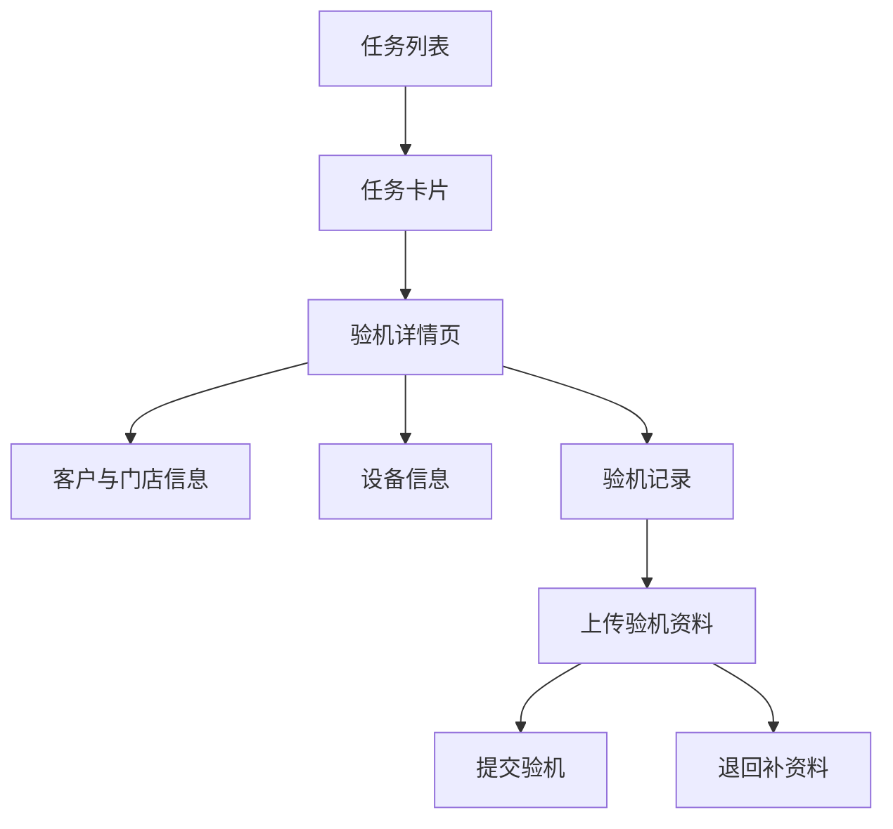
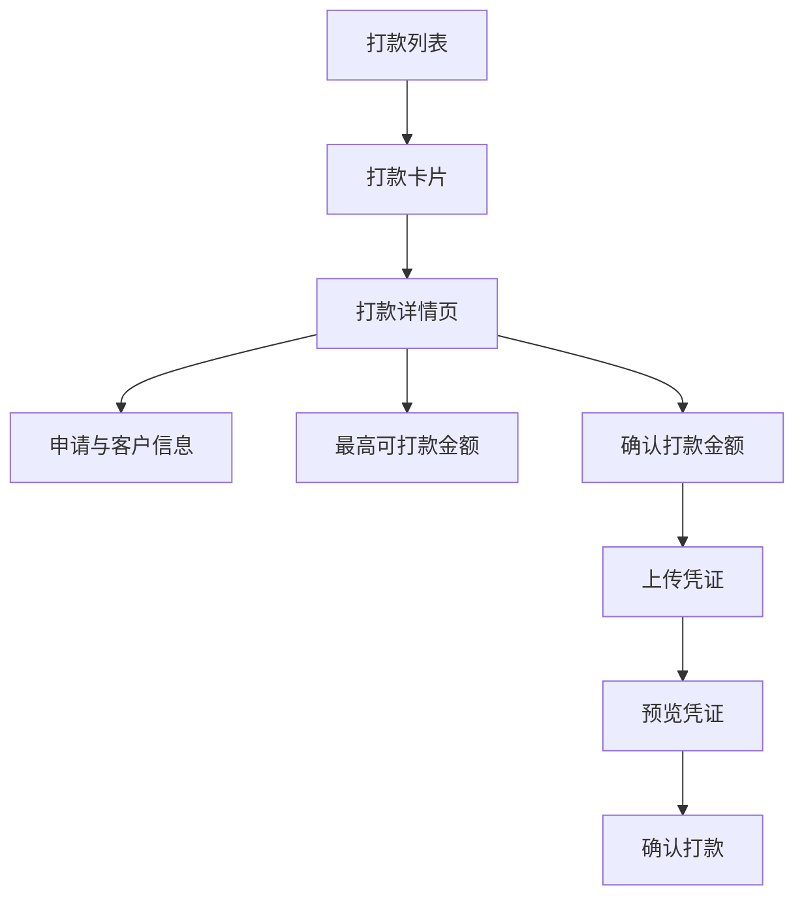
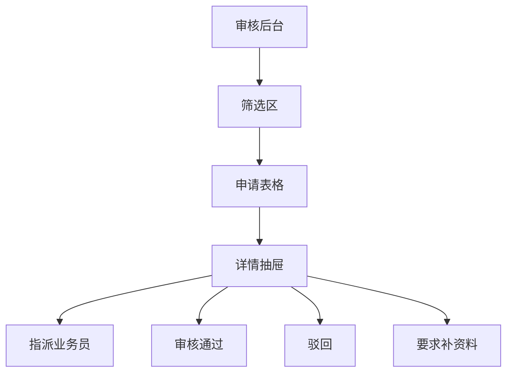

# v0.1 H5 业务体验优化设计说明

日期：2026-06-08  
范围：P2BOYUAN v0.1 业务测试版前端体验改造  
状态：待确认

## 1. 背景和目标

当前 v0.1 已经具备店家提交申请、审核员派单、业务员验机、审核通过/驳回/补资料、出纳打款、店家查看凭证、超级管理员重置数据的闭环能力。现在的问题不是核心业务缺失，而是部分角色的页面仍然像电脑后台，测试人员在手机上使用时不够像真实业务 App。

本次改造借鉴竞品的国际化 H5 和后台结构，但不复制品牌、素材、文案或业务状态。目标是让店家、业务员、出纳在手机上使用时形成清晰的 H5 工作流；审核员和超级管理员继续保留电脑后台效率，只做视觉和信息层级优化。

## 2. 总体方案

采用混合双端体验：

- 店家、业务员、出纳：移动 H5 优先，使用底部 Tab、卡片列表、纵向详情页、固定底部操作按钮。
- 审核员、超级管理员：电脑后台优先，使用左侧菜单、筛选区、表格列表、右侧详情抽屉。
- 状态名称：继续使用现有业务状态，不照搬竞品状态。
- 颜色风格：借鉴竞品的浅蓝、浅绿、浅灰、白色卡片、柔和阴影和大圆角输入区。
- 业务逻辑：尽量复用现有接口、状态机和数据结构，第一阶段不新增真实库存、合同签署、逾期、租用中等后续模块。

## 3. 信息架构

### 3.1 H5 端角色

店家底部 Tab：

- 订单
- 录单台
- 我的

业务员底部 Tab：

- 任务
- 验机台
- 我的

出纳底部 Tab：

- 打款
- 凭证
- 我的

### 3.2 后台端角色

审核员后台：

- 申请列表
- 派单与审核
- 详情抽屉

超级管理员后台：

- 数据概览
- 测试账号
- 申请状态调整
- 一键重置测试数据

## 4. 页面结构图

### 4.1 H5 总结构

### 4.2 店家录单流程

### 4.3 业务员验机流程

### 4.4 出纳打款流程

### 4.5 审核后台流程

## 5. 页面清单和字段

### 5.1 登录页

用途：所有角色统一登录入口。

核心模块：

- 产品标题：博远业务系统
- 副标题：业务测试版
- 账号输入
- 密码输入
- 角色快捷账号列表
- 登录按钮

交互：

- 点击快捷账号时自动填入账号和密码。
- 登录后根据角色进入对应首页。
- 移动端使用 H5 风格，桌面端居中卡片布局。

### 5.2 店家 - 订单页

用途：门店查看自己提交的申请和当前处理状态。

核心模块：

- 顶部统计：订单总数、待门店处理、已完成。
- 状态筛选：全部、待指派、验机中、待审核、需补资料、已驳回、待打款、已打款。
- 订单卡片列表。

订单卡片字段：

- 申请编号
- 状态标签
- 客户姓名
- 手机型号
- 颜色 / 容量
- 销售价
- 贷款金额
- 当前责任角色
- 下一步动作提示

主操作：

- 查看详情
- 补充资料（仅 NEEDS_SUPPLEMENT 且责任人为店家时显示）

### 5.3 店家 - 录单台

用途：门店协助客户提交验机申请。

核心模块：

- 基础业务信息
- 商品/机型选择
- 贷款/分期配置
- 确认摘要
- 客户基础信息
- 设备信息
- 资料上传区
- 底部操作栏

字段：

- 门店名称：默认当前账号所属门店，不可编辑。
- 商品/机型：从预设机型中选择，如 iPhone 16 Pro、iPhone 15 Pro 等。
- 品牌、型号、颜色、容量：选择商品后自动带出，可允许微调。
- 销售价：选择商品后自动带出，可允许编辑。
- 贷款金额：必填，不能超过销售价。
- 分期期数：必填，默认 12。
- 客户姓名、手机号、证件类型、证件号码、地址。
- IMEI、设备成色说明。
- 附件：客户证件、设备照片、补充资料。
- 备注。

主操作：

- 保存草稿：第一阶段可做前端占位，不一定落库。
- 提交申请：调用现有创建申请接口。

### 5.4 店家 - 详情页

用途：查看单笔申请详情、凭证和流程记录。

模块顺序：

- 状态概览
- 商品/设备信息
- 金额信息
- 客户信息
- 资料附件
- 验机/审核/打款记录
- 流程日志

主操作：

- 提交补资料
- 返回列表

### 5.5 业务员 - 任务页

用途：业务员查看被指派的验机任务。

核心模块：

- 顶部统计：全部任务、待验机、验机中、已提交。
- 状态筛选：全部、已指派、验机中、待审核、需补资料。
- 任务卡片列表。

任务卡片字段：

- 申请编号
- 客户姓名
- 门店名称
- 手机型号
- 贷款金额
- 当前状态
- 任务动作

主操作：

- 开始验机
- 继续验机
- 查看详情

### 5.6 业务员 - 验机详情页

用途：业务员完成到店验机和资料提交。

模块：

- 客户与门店信息
- 设备信息
- 贷款/分期信息
- 验机记录
- 验机附件上传
- 底部操作栏

字段：

- 验机备注
- 验机结果：通过 / 退回补资料
- 附件：设备照片、验机截图、其他资料

主操作：

- 提交验机
- 退回补资料

### 5.7 出纳 - 打款页

用途：出纳查看待打款和已打款记录。

核心模块：

- 顶部统计：打款记录、待打款、已打款金额。
- 状态筛选：全部、待打款、已打款。
- 打款卡片列表。

打款卡片字段：

- 申请编号
- 客户姓名
- 门店名称
- 贷款金额
- 状态
- 打款时间

主操作：

- 确认打款
- 查看凭证

### 5.8 出纳 - 打款详情页

用途：出纳确认线下打款并上传凭证。

模块：

- 申请与客户信息
- 最高可打款金额
- 打款金额输入
- 打款时间
- 凭证上传
- 凭证预览
- 备注
- 底部确认按钮

规则：

- 打款金额不能超过申请贷款金额。
- 未上传凭证不能确认打款。
- 已打款记录只允许查看，不允许重复确认。

### 5.9 我的页

用途：提供账号信息和退出入口。

字段：

- 当前账号
- 角色
- 所属门店或业务员档案
- 可见订单数量

主操作：

- 返回订单/任务/打款页
- 退出登录

### 5.10 审核员后台

用途：电脑端高效筛选、派单和审核。

核心模块：

- 左侧导航：审核工作台。
- 筛选区：申请编号、客户、状态、门店、业务员。
- 表格区：申请编号、客户、设备、金额、状态、当前责任人、更新时间、操作。
- 详情抽屉：完整申请详情。

主操作：

- 指派业务员
- 审核通过
- 审核驳回
- 要求店家补资料
- 要求业务员补资料

视觉优化：

- 更轻的浅蓝后台框架。
- 表格行距和状态标签优化。
- 操作按钮放入详情抽屉底部，减少表格拥挤。

### 5.11 超级管理员后台

用途：测试环境管理。

核心模块：

- 数据概览
- 测试账号列表
- 申请状态调整
- 一键重置测试数据

规则：

- 一键重置必须二次确认。
- 状态调整明确标注“测试辅助操作”。
- 不进入 H5 化。

## 6. 状态展示规则

| 状态值 | 中文展示 | 颜色建议 | 下一步提示 |
| --- | --- | --- | --- |
| PENDING_ASSIGNMENT | 待指派 | 蓝色 | 等待审核员指派业务员 |
| ASSIGNED | 已指派 | 浅蓝 | 等待业务员开始验机 |
| INSPECTION_IN_PROGRESS | 验机中 | 绿色 | 业务员正在验机 |
| PENDING_REVIEW | 待审核 | 紫色 | 等待后台审核 |
| NEEDS_SUPPLEMENT | 需补资料 | 橙色 | 当前责任人补充资料 |
| REJECTED | 已驳回 | 红色 | 流程结束 |
| PENDING_PAYOUT | 待打款 | 金色 | 等待出纳打款 |
| PAID | 已打款 | 绿色 | 凭证已上传 |
| COMPLETED | 已完成 | 灰绿色 | 已归档 |

## 7. 视觉规范

色彩方向：

- 页面背景：#eef5ff、#edf7ef、#f6f8fb。
- 主按钮：蓝色或绿色，按角色可微调。
- 关键金额：深蓝或深红，仅用于强调。
- 状态标签：低饱和浅底色，避免满屏红色。

布局方向：

- H5 页面最大宽度按 390-430px 手机视口设计。
- 卡片圆角 12-16px。
- 输入框高度至少 52px，方便手指点击。
- 底部 Tab 固定。
- 关键操作按钮固定在详情页底部。
- 页面避免左右两栏，全部改为纵向分组。

后台视觉：

- 保留左侧菜单和表格。
- 使用浅蓝顶栏和白色表格容器。
- 筛选区收纳为白色卡片。
- 详情使用右侧抽屉。

## 8. 数据和接口影响

第一阶段尽量不改后端表结构。

可复用字段：

- `brand`
- `model`
- `color`
- `capacity`
- `salePrice`
- `loanAmount`
- `periods`
- `customerName`
- `customerPhone`
- `idType`
- `idNumber`
- `customerAddress`
- `imei`
- `deviceCondition`
- `remark`

前端新增“商品/机型选择”可以先使用本地预设数据，不新增商品表。选择商品后自动填充品牌、型号、颜色、容量、销售价等字段。后续如果进入 v0.2 或 v0.3，再考虑接入真实商品管理和库存。

接口影响：

- 创建申请接口保持不变。
- 申请列表接口保持不变。
- 申请详情接口保持不变。
- 验机、审核、打款接口保持不变。
- 附件上传接口保持不变。

## 9. 实施边界

本次包含：

- H5 登录页视觉优化。
- 店家 H5 三 Tab。
- 业务员 H5 三 Tab。
- 出纳 H5 三 Tab。
- 商品/机型选择的前端预设。
- 纵向详情页。
- 后台审核员和超管视觉优化。

本次不包含：

- 多语言切换。
- 真实商品库存。
- 商品后台管理。
- 合同签署。
- 逾期订单。
- 租用中/买断流程。
- 真实短信、支付、银行 API。

## 10. 验收标准

移动端：

- 390px 宽度下，店家、业务员、出纳不出现横向滚动。
- 点击卡片后详情立即可见，不再跳到页面底部。
- 录单台可以按商品选择、客户资料、设备资料、附件上传的顺序完成申请。
- 出纳可以查看最高可打款金额、上传并预览凭证。
- 底部 Tab 在手机端稳定可用。

桌面端：

- 审核员和超级管理员保留后台效率。
- 表格和详情不互相遮挡。
- 详情抽屉内操作清晰。

业务：

- 现有 v0.1 闭环流程不被破坏。
- 所有现有测试账号仍可登录。
- 现有 API 测试通过。
- 前端生产构建通过。

## 11. 风险和处理

风险：前端页面改动较大，可能影响已有角色流程。  
处理：分角色实施，先做店家，再业务员，再出纳，最后后台视觉优化。每完成一个角色都做一次登录和关键流程验证。

风险：商品/机型选择可能让用户误以为已有真实库存。  
处理：第一阶段标注为预设机型选择，不展示库存数量，不做商品管理入口。

风险：H5 和后台双体验会增加样式复杂度。  
处理：抽取共享的状态标签、订单卡片、详情区块、底部 Tab、后台表格容器样式。

## 12. 推荐实施顺序

1. 建立 H5 基础壳层和底部 Tab。
2. 改造店家订单页和录单台。
3. 改造申请详情为纵向详情页。
4. 改造业务员任务和验机页。
5. 改造出纳打款和凭证页。
6. 优化审核员后台。
7. 优化超级管理员后台。
8. 全角色回归测试和移动端截图检查。
